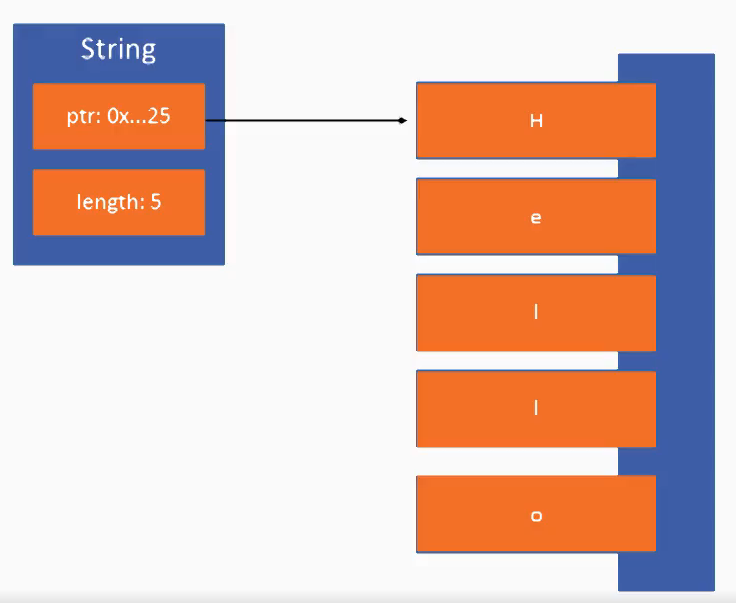
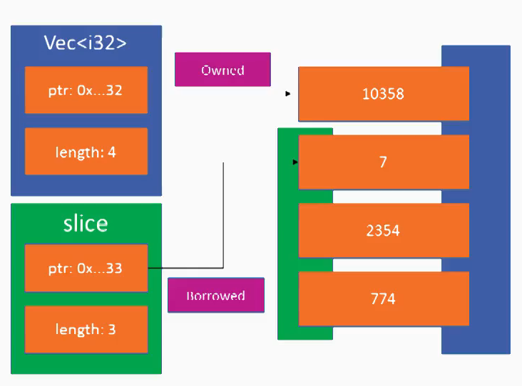

+++
title = "Rust"
weight = 1
insert_anchor_links = "left"
+++

## Fedora Perks

- DNF

```bash
sudo dnf install rust rust-doc.x86_64 rust-std-static.x86_64 rust-debugger-common.noarch rust-analysis.x86_64 rust-packaging.x86_64 --best --allowerasing -y
```

- Nvim
```vim
call plug#begin('~/.vim/plugged')
" Rust
Plug 'rust-lang/rust'
Plug 'rust-lang/rust.vim'
call plug#end()
```

## Lang

- Immutable, this next program will not compile

```rust
let var = "lol";
var = "chorizo";
```

- If you want a mutable var just:

```rust
let mut var = 1;
var = var + 1;
var = var + 15;
```

- First Functions
```rust
fn main() {
    println!("Hello World");
}
```

```rust
fn main() {
    let a = 1;
    let b = 2;
    println!("{} + {} is {}", a, b, a+b);
}
```

- Types

```rust
// Bools

let x = true;
let x: bool = true;
let y = false && true; #False

// Chars
// Not 8-bit like C, but unicode scalars which means that support unicode ootb

let c: char = "A";
let d: char = "";


// Integers (like C)

let a: i8 = -15;
let b: u8 = 250;
let c: i16 = -356;
let d: u16 = 1029;
let f: i32 = -31337;
let g: u32 = 42949672;
let h: i64 = -4294967295;
let i: u64 = 18446744073709551615;
let j: isize = -1;  # Signed 
let k: usize = 1;   # Unsigned


// Floating

let single: f32 = 1.1225 * 10.0;
let double: f64 = 1.2e-15;


//Containers

let array: [i8, 3] = [1, 4, 7];
let tuple: (i32, char) = (21, 'x');
println!("{}, {}", array[1], tuple.1); # Will print 4, x


// Functions Parameters

fn add(a: i32, b: i32) -> i32 {
    return a + b;
}

fn add_2(a: i32, b: i64) -> i32 {
    return a + (b as i32);
}

fn main() {
    let a = 1;
    let b = 3;
    println!("{} + {} is {}", a, b, add(a,b));
    println!("{} + {} is {}", a, b, add_2(a,b));
}
```

- Crates and Modules

```rust
use std::collections::LinkedList;

fn main() {
    let mut ll = LinkedList::new();
    ll.push_back(1);
    ll.push_back(2);
    ll.push_back(4);

    for a in ll {
        println!("{}", a);
    }
}
```

```rust
use std::collections::Vec;

fn main() {
    let mut v = Vec::new();
    v.push('x');
    v.push('y');
    v.push('z');

    for a in v {
        println!("{}", a);
    }
}
```

- New module
```rust
use hello::say_hello;

mod hello {
    pub fn say_hello() {
        println("Hello World!");
    }
}

fn main() {
    say_hello();
}
```

### Concatenate Strings

When you concatenate strings, you need to allocate memory to store the result. The easiest to start with is String and &str:

```rust
fn main() {
    let mut owned_string: String = "hello ".to_owned();
    let borrowed_string: &str = "world";

    owned_string.push_str(borrowed_string);
    println!("{}", owned_string);
}
```

Here, we have an owned string that we can mutate. This is efficient as it potentially allows us to reuse the memory allocation. There's a similar case for String and String, as &String can be dereferenced as &str.

```rust
fn main() {
    let mut owned_string: String = "hello ".to_owned();
    let another_owned_string: String = "world".to_owned();

    owned_string.push_str(&another_owned_string);
    println!("{}", owned_string);
}
```

After this, another_owned_string is untouched (note no mut qualifier). There's another variant that consumes the String but doesn't require it to be mutable. This is an implementation of the Add trait that takes a String as the left-hand side and a &str as the right-hand side:

```rust
fn main() {
    let owned_string: String = "hello ".to_owned();
    let borrowed_string: &str = "world";

    let new_owned_string = owned_string + borrowed_string;
    println!("{}", new_owned_string);
}
```

Note that owned_string is no longer accessible after the call to +.

What if we wanted to produce a new string, leaving both untouched? The simplest way is to use format!:

```rust
fn main() {
    let borrowed_string: &str = "hello ";
    let another_borrowed_string: &str = "world";

    let together = format!("{}{}", borrowed_string, another_borrowed_string);
    println!("{}", together);
}
```

Note that both input variables are immutable, so we know that they aren't touched. If we wanted to do the same thing for any combination of String, we can use the fact that String also can be formatted:

```rust
fn main() {
    let owned_string: String = "hello ".to_owned();
    let another_owned_string: String = "world".to_owned();

    let together = format!("{}{}", owned_string, another_owned_string);
    println!("{}", together);
}
```

You don't have to use format! though. You can clone one string and append the other string to the new string:

```rust
fn main() {
    let owned_string: String = "hello ".to_owned();
    let borrowed_string: &str = "world";

    let together = owned_string.clone() + borrowed_string;
    println!("{}", together);
}
```

Note - all of the type specification I did is redundant - the compiler can infer all the types in play here. I added them simply to be clear to people new to Rust, as I expect this question to be popular with that group!

## Ownership & Borrowing

- Eliminates all mem unsafety then will never seg fault
    - When a program tries to access to a Virt mem space outside of it's allowed area (seg Fault)
- With a strict static compile time checking (Borrow checker:
    - Seg faults: ^^
    - Buffer Overruns: Read off the end of an array
    - Dangling Pointers: Memory freed but the pointer is still there, then you could try to use it (in other languages)
    - Double frees: Allocate mem, free them, an then free them again, causing issues and revealing sensitive info
    - Use-After-Frees: Tries to use the mem already freed

- GC: Statically compiled, minimum impact on performance
- Concurrency:
    - Fearless concurrency: The mem management of Rust and the Borrow checker takes care about preventing and avoid data races.

- Ownership sample:
```rust
// a owns the value
let a = foo();

// now b owns the value
let b = a;

// ownership passed to do_something()
do_something(b);

// This will fail
do_something_else(b);
```

- How Ownership works:
    - Every valuee has an owner
    - Ownership can be passed around by binding and/or function calls
    - Once ownership is passed, the old binding can't be user again
    - This prevents use-after-free

- Borrowing sample
```rust
// a owns the value
let a = foo();

// a still owns the value
let b = &a;

// But functions still could use it
do_something_yet_again(&a);
```

- How Mut and non-Mut Borrowing works:
    - You cannot pass the ownership of a borrowed var
    - In the past example you cannot pass the ownership of b
    - Borrowed values are inmutable, even if the value is mutable that borrow can't be used to mutate the value
    - Either One mutable or Many inmutable borrows
    - You can share state or you can mutate state but you can't do both

- Mutable Borrowing sample
```rust
let a = foo();
let b = &a;

// Error, Cannot move borrowed value
do_something(a);
```

- Mutable borrows:
    - Allow values to be changed without transfering the ownership
    - Ony one mutable borrow can exists at one and non-mutable borrows can exist a the same time

- Sample Mut and non-Mut to the same borrow
```rust
let mut a = 10;
let b = &mut a;
b += 1;

// Error cannot have mutable and inmutable borrows
let c = &a;
b += 1;
```

- RAII
    - Stands for Resource Allocation is Initialization
    - You get resources (mem, files, db cons) when you initialize them and free them when you de-initialize them
    - Ownership make this easy for Rust to be managed

- RAII Sample
```rust
fn munge_file() {
    let mut file = File::create("file.txt")?;
    file.write_all(b"hello world");
} // file closed auto when the functions finishes because no-one is owning the file handler
```

- Shared and exclusive Access, sample
```rust
fn take_ownership_of_value(v: Vec<i32>) -> i32 { 
    let mut sum = 0;
    for val in v { sum += val; }
    return sum;
}

fn main() {
    let arr = vec![1,2,3,4,5,6,7,8,9];
    let sum = take_ownership_of_value(arr);
    // This will give us an err because the function 'take_ownership_of_value'
    // owns the value and when finishes frees the resource.
    println!("Sum of {} values: {}", arr.len(), sum);
}

```

- But we could do this instead:
```rust
fn borrow_sum (v: &Vec<i32>) -> i32 {
    // Receives a reference (mem position)
    let mut sum = 0;
    for val in v { // We iterate over mem positions.
        // This is a pointer that points to the content.
        sum += *val;  
    }
    return sum;
}

fn main() {
    let arr = vec![1,2,3,4,5,6,7,8,9];
    let sum = borrow_sum(&arr);
    println!("Sum of {} values: {}", &arr.len(), sum);
}
```

- Sample of mutable reference to vector
```rust
fn cap_value_borrow(max: i32, v: &mut Vec<i32>) {
    for index in 0..v.len() {
        if v[index] > max {
            v[index] = max;
        }
    }
}

fn main() {
    let mut arr = vec![1,2,3,500000,4,5];
    cap_value_borrow(10, &mut arr);
    for v in arr {
        println!("{}", v);
    }
}

// The output
:!./vec_mut_ref                                                                                                                                                                                         
1
2
3
10
4
5
```

### Strs, Vecs, Strings and Slices

- Strings and Vecs are almost the same:
    - Heap allocated
    - Consist of a pointer to that heap memory and a little data
    - when we create a Vec, we receive a lenght and a pointer where the vec starts



- Slices & Strs
    - Allow passing around views into hep without copying values or passing raw pointers
    - They consist also on a pointer and a lenght but without owning the data
    - WARN: You Can't directly hold an str or a slice because ir doesn't own the it's mem 
    - WARN: You have to have a reference, since it is basically a reference (and the original vars are freed)

- Sample code
```rust
let a = vec![1,2,4,6,7,8];
let sla = &a[1..2];
// sla = &[2,4]

let b = String::from("Hello");
let slb = &b[1..2];
// slb = "el"
```

### Strict Borrow checker

- Cannot borrow as inmutable due to existing mutable borrow
- Cannot borrow as mutable due to existing inmutable borrow
- Cannot have multiple mutable borrows
- Cannot move while borrow exists
- Cannot use moved value

- 




## Epic Resources

- [Rust Playground](play.rust-lang.org)
- [Rust Cheatsheet](https://cheats.rs)
- [Rust By Example](https://doc.rust-lang.org/rust-by-example/)
- [Rust Programming Language (Book)](https://doc.rust-lang.org/book/)
